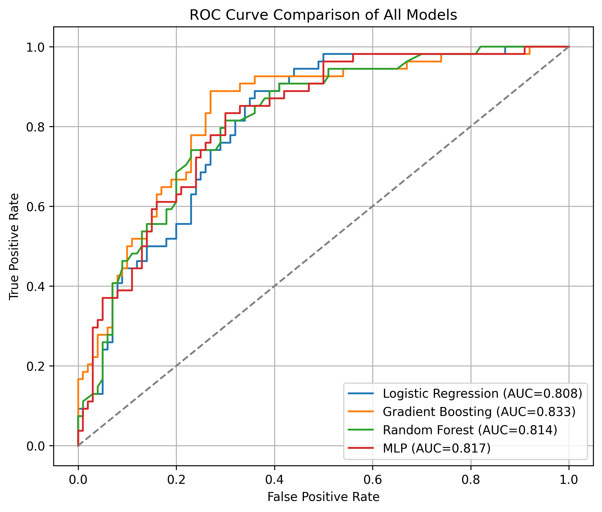
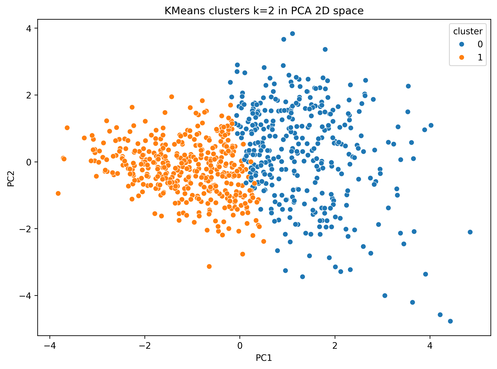

# Pima Diabetes Prediction and Patient Clustering Analysis

This project performs diabetes prediction and patient subtype discovery on the Pima Indians Diabetes Dataset using Logistic Regression, Random Forest, MLP, Bootstrap Inference, KMeans, and Hierarchical Clustering.

## Sample Outputs

### ROC Curve Comparison



### Cluster Visualization



## Results

Model performance comparison:

| Model | Accuracy | ROC-AUC |
|---------|----------|----------|
| Logistic Regression | 0.701 | 0.837 |
| Gradient Boosting | 0.766 | 0.832 |
| Random Forest | 0.766 | 0.849 |
| MLP Classifier | 0.740 | 0.821 |

Key findings:

- Random Forest achieved the highest ROC-AUC.
- Glucose was identified as the most influential predictor of diabetes risk.
- BMI and Age also demonstrated strong predictive importance.
- Clustering analysis identified patient subgroups with different diabetes prevalence rates.

## Project Overview

The goal is to predict diabetes outcomes and explore possible patient subtypes based on medical features.

The project includes:

- Data cleaning and missing value imputation
- Feature standardization
- Classification models:
  - Linear Regression baseline
  - Logistic Regression
  - Gradient Boosting
  - Random Forest
  - MLP Classifier
- Model evaluation:
  - Accuracy
  - Classification report
  - Confusion matrix
  - ROC curve and AUC
  - Calibration curve
- Bootstrap confidence intervals for logistic regression coefficients
- Unsupervised clustering:
  - KMeans clustering
  - Hierarchical clustering
  - PCA visualization
  - Cluster outcome distribution

## Dataset

Dataset: Pima Indians Diabetes Database

The script downloads the dataset automatically using `kagglehub`.

## Requirements

```text
pandas
numpy
matplotlib
seaborn
scikit-learn
scipy
tqdm
kagglehub
```

## Project Structure

```text
Pima Diabetes Analysis/
│
├── Diabetes analyse.py
├── README.md
│
└── output/
    ├── figures/
    ├── hierarchical_cluster_summary.csv
    ├── kmeans_cluster_summary.csv
    ├── logistic_coef_bootstrap_summary.csv
    ├── model_auc_comparison.csv
    ├── model_metrics_summary.csv
    ├── pima_clusters.csv
    └── results_summary.txt
```

## How to Run

### 1. Install Dependencies

Create a Python virtual environment (recommended):

```bash
python -m venv .venv
```

Activate the environment:

Windows:

```bash
.venv\Scripts\activate
```

Install required packages:

```bash
pip install -r requirements.txt
```

### 2. Run the Analysis

Execute the main script:

```bash
python "Diabetes analyse.py"
```

The script will automatically:

- Download the Pima Diabetes dataset
- Perform data preprocessing and imputation
- Train multiple machine learning models
- Evaluate classification performance
- Perform clustering analysis
- Generate figures and summary files

## Outputs

All generated files are saved inside the output/ directory.

### Figures

The following visualizations are generated:

- Confusion Matrix Comparison
- ROC Curve Comparison
- Individual ROC Curves
- AUC Comparison Bar Chart
- Predicted Probability Distributions
- Calibration Curves
- Correlation Heatmap
- KMeans Elbow Plot
- KMeans Silhouette Score Plot
- PCA Cluster Visualization
- Cluster Centroid Heatmap
- Hierarchical Clustering Dendrogram
- Hierarchical Cluster PCA Visualization

### CSV Results

The script exports:

```text
output/
├── logistic_coef_bootstrap_summary.csv
└── pima_clusters.csv
```

#### logistic_coef_bootstrap_summary.csv

Contains:

- Logistic regression coefficient means
- 95% bootstrap confidence intervals
- Feature importance ranking

#### pima_clusters.csv

Contains:

- Original patient records
- KMeans cluster assignments
- Hierarchical cluster assignments

## Machine Learning Models

The following models are evaluated and compared:

| Model | Description |
|-------|-------------|
| Linear Regression | Baseline binary prediction model |
| Logistic Regression | Main interpretable classification model |
| Gradient Boosting | Tree-based ensemble model |
| Random Forest | Bagging ensemble model |
| MLP Classifier | Feed-forward neural network |

Performance metrics include:

- Accuracy
- Precision
- Recall
- F1 Score
- ROC AUC
- Confusion Matrix

## Clustering Analysis

Two unsupervised learning methods are used:

### KMeans Clustering
- Elbow Method
- Silhouette Analysis
- Cluster Profiling
- Outcome Distribution Analysis

### Hierarchical Clustering
- Ward Linkage
- Dendrogram Visualization
- Agglomerative Clustering
- Cluster Agreement Analysis (Adjusted Rand Index)

## Technologies
- Python
- Pandas
- NumPy
- Scikit-Learn
- SciPy
- Matplotlib
- Seaborn
- KaggleHub
- TQDM

## Project Highlights
- End-to-end diabetes prediction pipeline
- Comparison of linear, tree-based, and neural-network models
- Bootstrap confidence interval estimation
- Patient subtype discovery through clustering
- Automated figure generation
- Fully executable standalone Python implementation

## Future Improvements

Potential extensions include:

- XGBoost and LightGBM models
- Hyperparameter optimization
- SHAP-based model interpretation
- Cross-validation framework
- Class imbalance handling
- Clinical risk scoring system

## Author

Wei Sun

M.S. Mechanical Engineering, Columbia University

Expected Graduation: Dec 2026